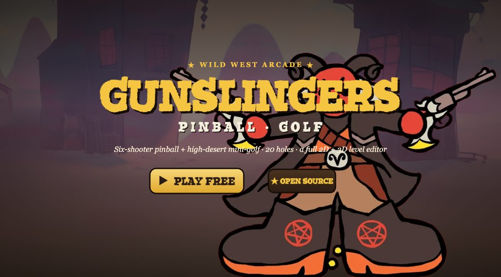
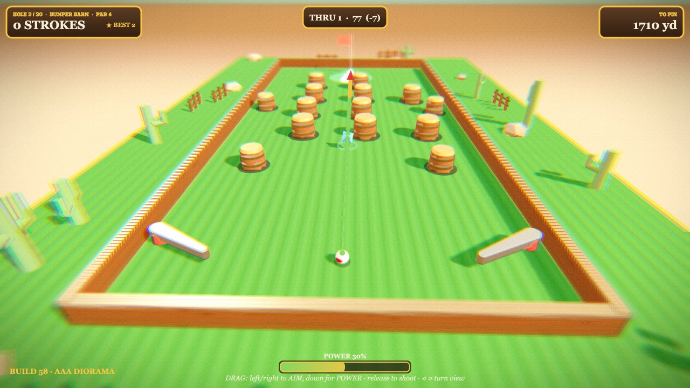
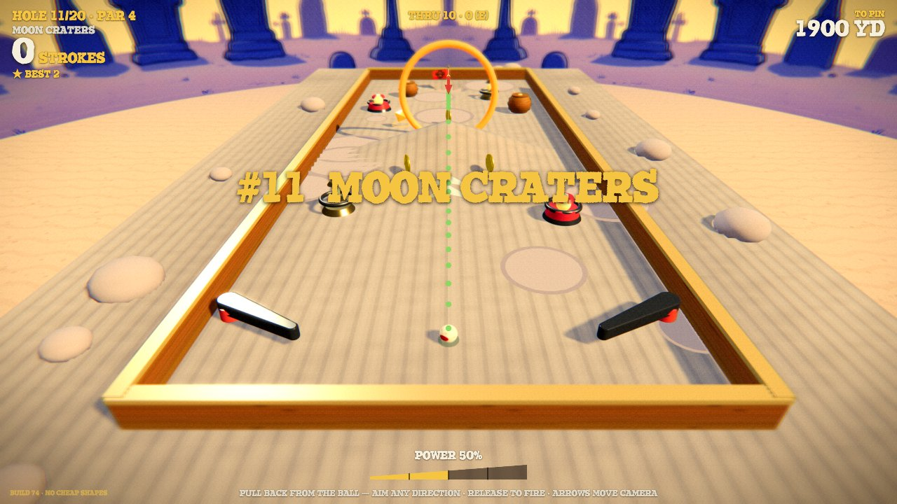
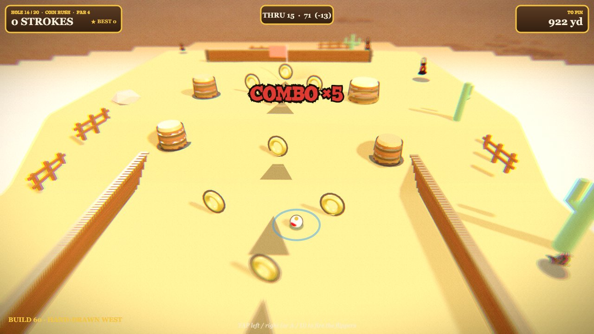

<div align="center">

[](https://princezoho.github.io/gunslingers-pinball-golf/)

# 🤠 Gunslingers Pinball Golf

**A _daily_ Wild-West golf game — one shared hole every day. Race everyone's ghosts, form a posse, climb the champions ladder, and share your score. Plus 36 holes of six-shooter _pinball + mini-golf_ chaos — with see-through glass tunnels — right in your browser.**

### [⭐ &nbsp;Play today's daily](https://princezoho.github.io/gunslingers-pinball-golf/game.html?daily) &nbsp;·&nbsp; [▶ &nbsp;All 36 holes](https://princezoho.github.io/gunslingers-pinball-golf/)

No installs, no sign-up. Runs on Three.js + a single JS file.

</div>

---

Putt the ball through pinball mayhem — flippers, bumpers, Dutch windmills, lasers, loop-de-loops, fire hoops, teleport portals and **see-through glass tunnels** — and mini-golf wackiness — ramps, jumps, funnels, multi-tier greens — across **36 hand-built holes**. Play against golf par (birdies, bogeys, hole-in-ones), chain **bumper combos**, save your **best score per hole**, and tally it on an end-of-round scorecard. Then **build your own courses** in a full **2D + 3D level editor**.

## ⭐ The Daily — a new hole every day

The heart of the game is the **daily hole**: one shared hole that everyone plays, Wordle-style.

- **One shot a day.** Sink today's hole, then come back tomorrow for a fresh one. Re-opening the daily shows your result instantly (replays are just practice).
- **Race the ghosts.** From your first swing you race a translucent rival — the best real player's run that day — and the result card tells you if you **beat them**.
- **Live leaderboard + records.** Post your score to today's board, see your **rank of N players**, the **field difficulty** ("🔥 Brutal hole today — field avg +2"), and the hole's **all-time course record** — beat it for a "🏆 NEW COURSE RECORD".
- **Share it everywhere.** One tap to the **native share sheet** (Messages / WhatsApp / Discord / X / anywhere), **share on X**, **copy for Discord**, or copy a **challenge link** that drops a friend into the same hole racing _your_ ghost. Plus a one-tap **highlight GIF** of your sinking shot, signed with your name.
- **Keep your streak.** Daily play streaks (with a "🔥 your streak is on the line" nudge), lifetime career stats, and a **past-days archive** to play holes you missed.
- **Owner sets the hole.** A passcode-gated **Daily Studio** (`owner.html`) lets the owner propose, edit, and publish each day's hole (or bank holes for future dates) — and watch a live **engagement panel** (players/plays today + this week, top teams).

> The daily, ghosts, leaderboard, teams and sharing run on a free [Supabase](https://supabase.com) backend (anti-cheat run submission guarded by row-level security); the game itself is still a static site and falls back to a date-seeded hole if offline.

## 🏴 Teams &amp; competition — play with your posse

The daily isn't just you vs. the field — it's **teams vs. teams** and a season-long climb.

- **Form a posse.** Create or join a **team** with a one-tap invite link, then battle other teams on the daily **team leaderboard** (best-ball: your crew's lowest score counts). Teams keep their own **all-time record + daily streak**.
- **Champions ladder.** A persistent **🏆 Champions** board ranks **players _and_ teams**, **this week** or **all-time**, by daily wins. Flex your standing with a one-tap **"share my rank"**.
- **Pass &amp; play modes.** Grab friends on one device: **Team Ball** (alternate shot — partners take turns hitting the _same_ ball) or **Best Ball** (everyone plays the hole, lowest score wins). Both are shareable.
- **Always see the ball.** Walls between the camera and your ball go **see-through** automatically, and **glass tunnels** let the ball roll through cover while staying fully visible — so you can always see what you're doing.

## 📸 Screenshots

|  |  |
|:--:|:--:|
| [](https://princezoho.github.io/gunslingers-pinball-golf/) | [](https://princezoho.github.io/gunslingers-pinball-golf/) |
| **Bumper Barn** — pinball-style obstacle holes | **Moon Craters** — low-gravity, night sky, crater turf |

[](https://princezoho.github.io/gunslingers-pinball-golf/)

> Chain bumper hits for an escalating **COMBO ×N**, with shockwaves, particle bursts, a Wild-West soundtrack and comic-book sound effects on every hit.

## ▶ Play it

The easiest way is the **[live demo](https://princezoho.github.io/gunslingers-pinball-golf/)**. To run it locally it's a static site — serve the folder over HTTP:

```bash
python3 -m http.server 8754
# then visit http://localhost:8754   (landing page → click PLAY)
# the game directly:  http://localhost:8754/game.html
```

(Opening via `file://` won't work because the font / asset loads need HTTP.)

## 🎮 Controls

**Aiming a shot** — drag on the table: left/right to aim, down for power, release to fire. A live trajectory preview shows the path, including bank shots off the walls.

**Flippers (while the ball rolls)** — tap the left/right half of the screen, or press `A`/`←` and `D`/`→`.

**Power-ups** — roll over them to grab: **Magnet** (pulls you to the cup, with a tractor-beam), **Shield** (a bubble that blocks the next hazard), **Slow-mo** (bullet-time through gates), **Gem** (bonus points), **Jump** (hop over walls).

**Sound & music** — tap the 🔊 speaker (bottom-right) for the audio panel: independent **Master / Music / SFX** sliders, mute, and a track-skip for the soundtrack. Everything defaults to **50%** (never full-blast).

Buttons (top-left in game): **Level Editor**, **Levels** (pick/skip any hole), **Skip**.

## 🛠 Level Editor

- **2D top-down editor** with a tool palette: walls (freehand draw, click-corners, or 2-click), bumpers, boosters, flippers, windmills, loops, drop-holes, **portals with up to 3 random exits**, fire hoops, enemies (patrol/chase, knockback/reset/stun), coins, power-ups, lasers, hills, funnels, ramps, tiers, and up/down terrain painting.
- **3D editor mode** (🧊): orbit the level in 3D and click items to select/drag them.
- Every item has live, editable stats (radius, bounce, speed, rotation, height, points, …).
- **7 terrain themes**, each with its own physics _and look_: Grass, Ice (slides), Moon (low-G), Mud, Rubber, Speedway, Sand.
- Per-level settings: gravity, friction, bounce, cup size, par, board size, tilt.
- **Test** your level instantly, then jump back to editing.
- **Save / Load / Export (JSON or download) / Import (paste or file)**. Saves persist in `localStorage` and survive reloads.
- Undo/redo, duplicate, delete, grid snap, collapsible panels, responsive layout.

## 🧱 Tech

Single-file engine in [`js/pingolf.js`](js/pingolf.js): a fixed-timestep 3D heightfield golf/pinball simulation, a `builder()` DSL for holes, a self-contained DOM/canvas editor, and a small Web-Audio mixer (master/music/SFX gains) driving a looping soundtrack. Rendering via [Three.js](https://threejs.org/) (`vendor/three.min.js`, MIT). `index.html` is the landing page, `game.html` hosts the engine, `owner.html` is the Daily Studio.

The daily/social layer: runs are recorded as compact ghost paths, replayed as translucent rival balls, and shared via URL-safe base64 in challenge links. The highlight GIF is encoded by a dependency-free GIF89a writer ([`vendor/gifquick.js`](vendor/gifquick.js)). The backend ([`js/net.js`](js/net.js)) is a tiny raw-`fetch` Supabase client — anti-cheat run submission, leaderboard/standing/difficulty RPCs, and passcode-gated owner publishing, all guarded by row-level security; the public anon key is safe to ship.

## 🎨 Art & audio

The **Gunslingers** artwork, characters, backgrounds and Wild-West music are bundled in [`assets/`](assets) so the game looks and sounds the way it's meant to. **These assets are © 2026 princezoho, all rights reserved — included to play and view, not licensed for reuse.** Only the *code* is MIT (see below).

## 📄 License

**Code** is released under the [MIT License](LICENSE). The bundled **art & music are reserved** (see the LICENSE file), along with notes on Three.js and the display font.
